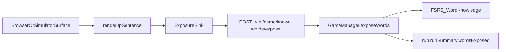

# 2026-04-20 RenderJpSentence Exposure Plan

## Goal

Make any visible `renderJpSentence()` render trigger word exposure automatically,
then keep FSRS, `runSummary`, and the simulator consistent with that rule.

## Reviewed Position

The user's architectural complaint is correct: there are real browser surfaces
that show Japanese through `renderJpSentence()` without ever exposing those
words to the learning system.

After tracing the live code, I do **not** think a bare hardcoded network side
effect inside `renderJpSentence()` is the cleanest boundary. The least risky
version of the requested architecture is:

1. `renderJpSentence()` becomes the trigger point.
2. The renderer emits exposures through an internal sink.
3. The browser wires that sink to `/api/game/known-words/expose`.
4. The server routes that request through the live `GameManager` so FSRS and
   `runSummary` stay authoritative.

This still follows the user's principle that exposure should happen whenever the
function is called, while avoiding a split brain between browser rendering and
server-side learning state.

## Investigated Facts

- `renderJpSentence()` in
  [public/js/ui/bootstrap-client.js](public/js/ui/bootstrap-client.js) is
  currently pure HTML generation.
- Server exposure is scattered across
  [src/game/services/combat-cycle-service.js](src/game/services/combat-cycle-service.js),
  [src/routes/game/run.js](src/routes/game/run.js), and
  [src/routes/game/combat.js](src/routes/game/combat.js).
- Many browser-only surfaces render through `renderJpSentence()` with no
  guaranteed exposure path, especially in
  [public/js/ui/exploration.js](public/js/ui/exploration.js),
  [public/js/ui/narration-box.js](public/js/ui/narration-box.js),
  [public/js/ui/exploration-dom.js](public/js/ui/exploration-dom.js),
  [public/js/ui/move-select.js](public/js/ui/move-select.js),
  [public/js/ui/move-learn.js](public/js/ui/move-learn.js),
  [public/js/ui/creature-row.js](public/js/ui/creature-row.js),
  [public/js/ui/pvp-lobby.js](public/js/ui/pvp-lobby.js),
  [public/js/ui/post-combat-shop.js](public/js/ui/post-combat-shop.js), and
  [public/js/ui/attack-card.js](public/js/ui/attack-card.js).
- The simulator under [simulator/engine](simulator/engine) does **not** use
  `renderJpSentence()` today. It depends on server `runSummary.wordsExposed` /
  `wordsImmersed`, especially in
  [simulator/engine/runner.js](simulator/engine/runner.js).
- The current `/api/game/known-words/expose` route in
  [src/routes/game/known-words.js](src/routes/game/known-words.js) calls bare
  `exposeWords(...)`, which updates FSRS storage but does **not** update the
  active run's `runSummary`. If renderer-owned exposure starts using this route
  as-is, simulator and adventure-report totals drift immediately.

## Architecture

## Proposed Changes

### 1. Add a renderer-owned exposure channel

- Update [public/js/ui/bootstrap-client.js](public/js/ui/bootstrap-client.js)
  so `renderJpSentence()` normalizes the same renderable content tokens it
  already displays into `{ word, meaning }` exposure entries.
- Add an internal, configurable exposure sink plus small batching/flush logic so
  repeated tokens from one render do not spam the network.
- Keep punctuation and non-content detection identical to the current renderer
  so exposure stays aligned with what the user actually saw.

### 2. Bridge renderer exposure back into the authoritative server state

- Add a client API helper in [public/js/api.js](public/js/api.js) for batched
  `/api/game/known-words/expose` requests.
- Configure the sink during bootstrap in [public/game.js](public/game.js).
- Change [src/routes/game/known-words.js](src/routes/game/known-words.js) to
  route exposure through the live manager using
  [src/game/manager-registry.js](src/game/manager-registry.js), so
  renderer-triggered exposure updates both FSRS and the active run summary.

### 3. Remove overlapping manual server exposure only where render-time exposure now covers the same content

- Audit and strip direct exposure calls from
  [src/game/services/combat-cycle-service.js](src/game/services/combat-cycle-service.js)
  for:
  - combat attack base/move words,
  - bark words,
  - befriend prompt words.
- Strip direct exposure from
  [src/routes/game/combat.js](src/routes/game/combat.js) for tokenized NPC
  fight/defeat lines.
- Strip direct exposure from
  [src/routes/game/run.js](src/routes/game/run.js) for friendly-NPC greeting and
  item-token exposure paths that now render through `renderJpSentence()`.
- Leave non-`renderJpSentence()` sources server-side for now, such as enemy
  formation names in [public/js/ui/combat-dom.js](public/js/ui/combat-dom.js)
  and review/discovery flows, so the refactor stays scoped and does not
  silently drop exposure.

### 4. Adapt the simulator to the new trigger point instead of preserving the old server-generation assumption

- Add a small simulator-side adapter that invokes the same renderer-trigger path
  when the simulator decides tokenized text was shown.
- Update [simulator/engine/combat.js](simulator/engine/combat.js) to trigger
  exposure for barks and befriend prompts via that shared path.
- Update [simulator/engine/rooms/friendly-npc.js](simulator/engine/rooms/friendly-npc.js)
  for greeting and chosen-item lines.
- Audit any simulator room handlers that log tokenized dialogue from API
  payloads and route them through the same exposure trigger before logging plain
  text.
- Keep [simulator/engine/runner.js](simulator/engine/runner.js) on the same
  aggregate contract: it should still trust server `runSummary` and daily
  known-word snapshots, not shadow-track local `word_exposure` events.

### 5. Update tests around the new contract

- Expand [tests/unit/sentence-renderer.test.js](tests/unit/sentence-renderer.test.js)
  to cover:
  - punctuation/non-content tokens do not expose,
  - entity tokens do expose,
  - meaning selection matches current renderer precedence,
  - batching/dedup behavior for one render pass.
- Update UI tests that currently stub `renderJpSentence()` so they either stub
  the new sink or explicitly opt out.
- Add an integration test around
  [src/routes/game/known-words.js](src/routes/game/known-words.js) proving
  `/expose` updates active-run `runSummary` when a manager exists, because the
  simulator and adventure report both depend on that truth.

## High-Risk Surfaces To Verify First

- [public/js/ui/exploration.js](public/js/ui/exploration.js): whack-a-mole GM
  question, yes/no buttons, skill-select prompt, friendly NPC greeting and
  purchase line.
- [public/js/ui/narration-box.js](public/js/ui/narration-box.js): speaker
  objects rendered via `renderJpSentence()`.
- [public/js/ui/exploration-dom.js](public/js/ui/exploration-dom.js): NPC role
  labels and skill pills.
- [public/js/ui/move-select.js](public/js/ui/move-select.js),
  [public/js/ui/move-learn.js](public/js/ui/move-learn.js),
  [public/js/ui/post-combat-shop.js](public/js/ui/post-combat-shop.js),
  [public/js/ui/creature-row.js](public/js/ui/creature-row.js), and
  [public/js/ui/pvp-lobby.js](public/js/ui/pvp-lobby.js): browser-only UI
  surfaces that currently never reach server exposure.
- [public/js/ui/attack-card.js](public/js/ui/attack-card.js): once manual
  combat exposure is removed, this becomes the browser authority for combat word
  exposure.

## Main Risk To Decide Explicitly During Implementation

This change will make repeated renders count as repeated exposures unless the
sink dedupes within a clear boundary. That boundary needs to be chosen
deliberately and documented, rather than left to incidental rerenders.

## Verification

- Unit: [tests/unit/sentence-renderer.test.js](tests/unit/sentence-renderer.test.js)
  plus affected UI mocks.
- Integration: `/api/game/known-words/expose` updates active-run `runSummary`
  correctly.
- Simulator: [simulator/engine/runner.js](simulator/engine/runner.js) still
  produces correct `words_exposed_today` from `runSummary.wordsImmersed`.
- Manual/browser spot checks: combat attack card, bark bubble, friendly NPC
  greeting, whack-a-mole prompt, skill-master prompt, and a speaker-object
  narration line.
